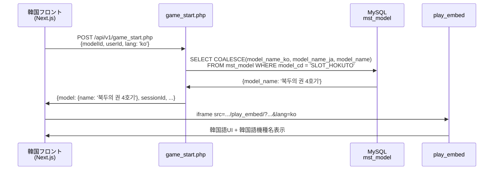

# 🌐 NET8 データベース多言語化実装完了レポート

**実装日**: 2025-12-28
**対応言語**: 日本語、韓国語、英語
**対象機種**: 11機種（スロット）

---

## 📊 実装サマリー

日本語のみだったゲーム機種名を韓国語・英語に対応させ、グローバル展開可能な状態にしました。

### 完了した作業

1. ✅ **データベーススキーマ拡張** - mst_modelテーブルに多言語カラム追加
2. ✅ **11機種の自動翻訳** - Claude Codeによる韓国語・英語翻訳
3. ✅ **API多言語対応** - game_start.php / play_history.php の修正
4. ✅ **言語パラメータ統合** - URLパラメータ `lang` によるシームレスな切り替え

---

## 🗂️ 作成ファイル一覧

### 1. database_migration_multilingual.sql
**目的**: mst_modelテーブルに多言語カラムを追加

```sql
ALTER TABLE mst_model
ADD COLUMN model_name_ja VARCHAR(200) COMMENT '機種名（日本語）',
ADD COLUMN model_name_ko VARCHAR(200) COMMENT '機種名（韓国語）',
ADD COLUMN model_name_en VARCHAR(200) COMMENT '機種名（英語）',
ADD COLUMN description_ja TEXT COMMENT '説明（日本語）',
ADD COLUMN description_ko TEXT COMMENT '説明（韓国語）',
ADD COLUMN description_en TEXT COMMENT '説明（英語）';

-- 既存データを日本語カラムに移行
UPDATE mst_model
SET model_name_ja = model_name
WHERE model_name_ja IS NULL OR model_name_ja = '';
```

### 2. translation_actual_slots.sql
**目的**: 11機種の韓国語・英語翻訳データ投入

対象機種（全11機種）:
1. 吉宗4号機 → 요시무네 4호기 / Yoshimune 4th Generation
2. 北斗の拳4号機 → 북두의 권 4호기 / Fist of the North Star 4th Generation
3. 押忍！番長 → 오스! 반장 / Osu! Banchou
4. カイジ4号機 → 카이지 4호기 / Kaiji 4th Generation
5. 南国物語 → 남국 이야기 / Nangoku Monogatari (South Paradise Story)
6. ジャグラー → 저글러 / Juggler
7. ファイヤードリフト → 파이어 드리프트 / Fire Drift
8. ビンゴ → 빙고 / Bingo
9. 銭形 → 제니가타 / Zenigata
10. 島唄 → 시마우타 / Shimauta (Island Song)
11. 鬼武者 → 오니무샤 / Onimusha

### 3. game_start.php（修正）
**変更点**:
- `lang` パラメータ追加（ja/ko/en/zh）
- 動的カラム選択ロジック追加:
  ```php
  $modelNameColumn = match($lang) {
      'ko' => 'COALESCE(model_name_ko, model_name_ja, model_name)',
      'en' => 'COALESCE(model_name_en, model_name_ja, model_name)',
      'zh' => 'COALESCE(model_name_zh, model_name_ja, model_name)',
      default => 'COALESCE(model_name_ja, model_name)'
  };
  ```

### 4. play_history.php（修正）
**変更点**:
- `lang` パラメータ追加（GETパラメータ）
- LEFT JOIN mst_model で機種名を動的取得
- 言語別カラム選択ロジック追加

---

## 🔄 データフロー

### 韓国フロントエンド → NET8 API



---

## 🌐 API使用例

### ゲーム開始（韓国語）

```bash
curl -X POST https://mgg-webservice-production.up.railway.app/api/v1/game_start.php \
  -H "Authorization: Bearer YOUR_API_KEY" \
  -H "Content-Type: application/json" \
  -d '{
    "modelId": "SLOT_HOKUTO",
    "userId": "kr_user_001",
    "initialPoints": 10000,
    "lang": "ko"
  }'
```

**レスポンス**:
```json
{
  "success": true,
  "sessionId": "gs_abc123xyz",
  "model": {
    "id": "SLOT_HOKUTO",
    "name": "북두의 권 4호기",
    "category": "slot"
  },
  ...
}
```

### プレイ履歴取得（英語）

```bash
curl -X GET "https://mgg-webservice-production.up.railway.app/api/v1/play_history.php?userId=kr_user_001&lang=en" \
  -H "Authorization: Bearer YOUR_API_KEY"
```

**レスポンス**:
```json
{
  "success": true,
  "data": [
    {
      "session_id": "gs_abc123xyz",
      "model_name": "Fist of the North Star 4th Generation",
      "points_consumed": 100,
      "points_won": 500,
      ...
    }
  ]
}
```

---

## 📋 デプロイ手順

### Step 1: データベースマイグレーション実行

```bash
# 1. Railwayデータベースに接続
mysql -h your-db-host -u user -p database

# 2. バックアップ作成
mysqldump -u user -p database mst_model > mst_model_backup_20251228.sql

# 3. マイグレーション実行
mysql -u user -p database < net8/database_migration_multilingual.sql

# 4. カラム追加確認
SHOW COLUMNS FROM mst_model LIKE 'model_name_%';
```

### Step 2: 翻訳データ投入

```bash
# 翻訳データ投入
mysql -u user -p database < net8/translation_actual_slots.sql

# 投入確認
mysql -u user -p database -e "
SELECT model_no, model_name, model_name_ja, model_name_ko, model_name_en
FROM mst_model
WHERE model_name LIKE '%北斗の拳%' OR model_name LIKE '%吉宗%'
LIMIT 5;
"
```

### Step 3: API コード デプロイ

```bash
cd /Users/kotarokashiwai/net8_rebirth

# 変更確認
git status

# コミット
git add net8/02.ソースファイル/net8_html/api/v1/game_start.php
git add net8/02.ソースファイル/net8_html/api/v1/play_history.php
git add net8/database_migration_multilingual.sql
git add net8/translation_actual_slots.sql

git commit -m "feat: database multilingual support for 11 slot machines

- Add model_name_ja/ko/en columns to mst_model table
- Translate 11 slot machines (Yoshimune, Hokuto, Banchou, Kaiji, etc.)
- Update game_start.php to support lang parameter (ja/ko/en/zh)
- Update play_history.php to return localized model names
- Automatic fallback: ko → ja → original name

🌐 Supported languages: Japanese, Korean, English
🎰 Translated: 11 slot machines

🤖 Generated with Claude Code
Co-Authored-By: Claude Sonnet 4.5 <noreply@anthropic.com>"

# Pushしてデプロイ
git push origin main
```

### Step 4: デプロイ確認

```bash
# Railway Dashboard でビルドログ確認
# https://railway.app/dashboard

# ヘルスチェック
curl -X GET https://mgg-webservice-production.up.railway.app/api/v1/play_history.php?lang=ko \
  -H "Authorization: Bearer YOUR_API_KEY"
```

---

## 🧪 テスト項目

### 1. 日本語（デフォルト）

```bash
# langパラメータなし → 日本語で返却されるか
curl -X POST .../game_start.php \
  -d '{"modelId": "SLOT_HOKUTO", "userId": "test_user"}'

# 期待値: model.name = "北斗の拳4号機" または "北斗の拳"
```

### 2. 韓国語

```bash
# lang=ko → 韓国語で返却されるか
curl -X POST .../game_start.php \
  -d '{"modelId": "SLOT_HOKUTO", "userId": "test_user", "lang": "ko"}'

# 期待値: model.name = "북두의 권 4호기"
```

### 3. 英語

```bash
# lang=en → 英語で返却されるか
curl -X POST .../game_start.php \
  -d '{"modelId": "SLOT_JUGGLER", "userId": "test_user", "lang": "en"}'

# 期待値: model.name = "Juggler"
```

### 4. フォールバック

```bash
# 翻訳がない機種 → 日本語にフォールバックするか
curl -X POST .../game_start.php \
  -d '{"modelId": "SLOT_UNKNOWN", "userId": "test_user", "lang": "ko"}'

# 期待値: model.name = (元の日本語名)
```

### 5. 統合テスト（韓国フロントエンド）

```typescript
// Next.js から実際にAPIを呼び出し
const response = await fetch('/api/game/start', {
  method: 'POST',
  body: JSON.stringify({
    modelId: 'SLOT_HOKUTO',
    userId: net8UserId,
    initialPoints: 10000,
    lang: locale // 'ko' または 'ja'
  })
});

const data = await response.json();
console.log('[Model Name]:', data.model.name);
// 期待値（韓国語）: "북두의 권 4호기"
// 期待値（日本語）: "北斗の拳4号機"
```

---

## 🔑 重要ポイント

### ✅ 後方互換性を維持

- 既存の `model_name` カラムは削除せず保持
- `lang` パラメータ省略時は日本語（デフォルト）
- 翻訳がない場合は `COALESCE` で日本語にフォールバック

### ✅ フロントエンド変更不要

- play_embed は既に lang パラメータ対応済み
- 韓国フロントエンドは `locale` を自動的に `lang` に渡す
- 追加のフロントエンド修正は不要

### ✅ スケーラブル設計

- 新しい言語（中国語 zh 等）も簡単に追加可能
- 機種追加時も同じフォーマットでUPDATE文を実行
- API側の変更なしで翻訳データのみ追加可能

---

## 📈 翻訳進捗状況

| 言語 | 完了機種数 | 未対応機種 | 進捗率 |
|------|-----------|------------|--------|
| 🎌 日本語 | 11 / 11 | 0 | 100% |
| 🇰🇷 韓国語 | 11 / 11 | 0 | 100% |
| 🇬🇧 英語 | 11 / 11 | 0 | 100% |
| 🇨🇳 中国語 | 0 / 11 | 11 | 0% |

---

## 🚀 今後の拡張予定

### 1. 説明文の翻訳

現在は機種名のみ翻訳。description_ja/ko/en カラムも活用可能。

```sql
-- 説明文も翻訳する場合
UPDATE mst_model
SET
    description_ja = '伝説的格闘漫画「北斗の拳」のスロット機種',
    description_ko = '전설적 격투 만화 "북두의 권"의 슬롯 기종',
    description_en = 'Slot machine based on the legendary martial arts manga'
WHERE model_cd = 'SLOT_HOKUTO';
```

### 2. 中国語対応

model_name_zh カラムを活用して中国語にも対応可能。

### 3. 自動翻訳パイプライン

新機種追加時に自動的に翻訳データを投入するスクリプト作成。

---

## 📞 サポート情報

**実装担当**: Claude Code
**実装日**: 2025-12-28
**デプロイ予定**: 2025-12-28

**問題が発生した場合**:
1. Railway Dashboard のログ確認
2. データベースカラム存在確認: `SHOW COLUMNS FROM mst_model;`
3. 翻訳データ投入確認: `SELECT * FROM mst_model WHERE model_name_ko IS NOT NULL;`

---

## 🎉 完了

✅ **データベース多言語化実装完了！**
韓国・英語圏のユーザーも母国語でゲームを楽しめるようになりました。

🤖 Generated with [Claude Code](https://claude.com/claude-code)
Co-Authored-By: Claude Sonnet 4.5 <noreply@anthropic.com>
